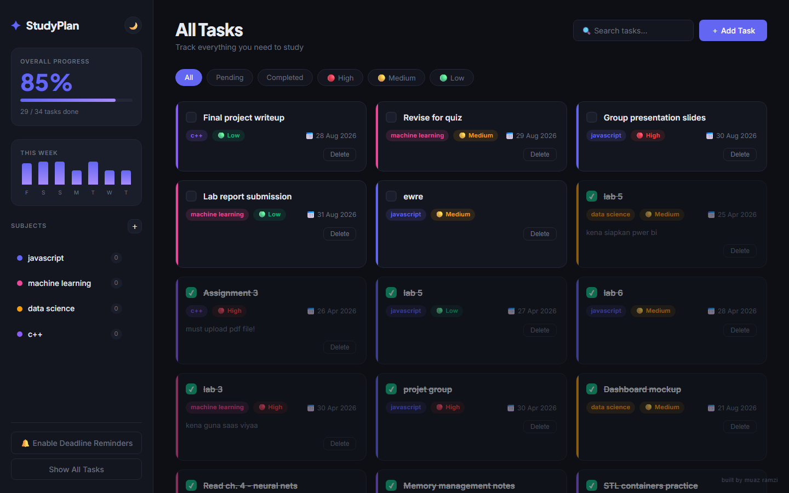
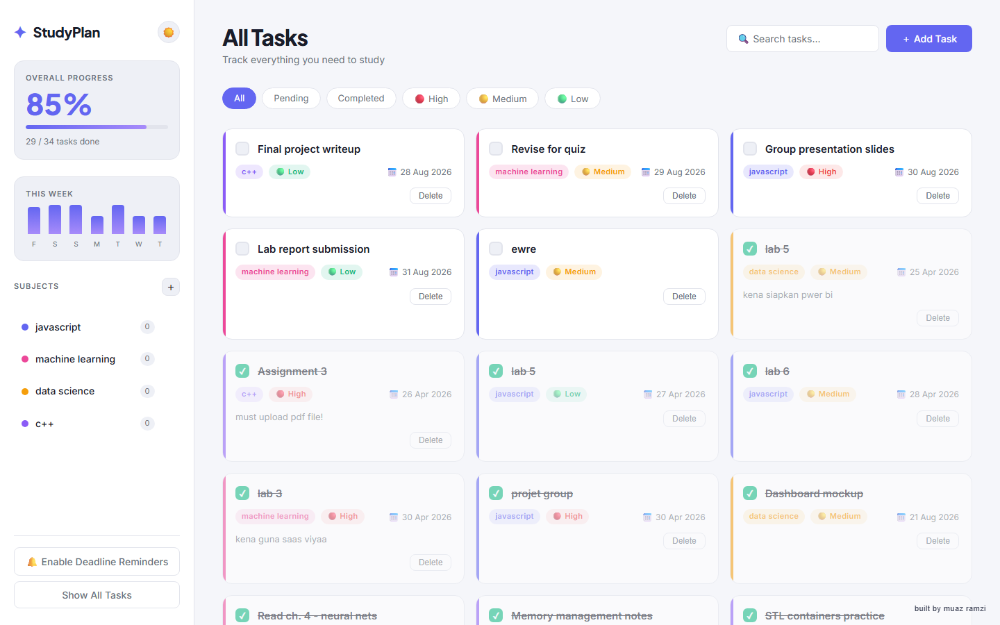

# 📚 Smart Study Planner

A clean, full-stack study task manager built with **Node.js + Express** on the backend and **vanilla HTML/CSS/JS** on the frontend. Data is stored in a local `data.json` file — no database needed.

**🔗 Live demo:** [smart-study-planner-production-9021.up.railway.app](https://smart-study-planner-production-9021.up.railway.app/)



---

## 🎯 Who this is for

Built for **students juggling multiple subjects at once** — the kind of week where a JavaScript lab is due Tuesday, a machine learning reading is due Wednesday, and a group presentation is due Friday, each tracked in a different place (or not tracked at all). If you're a student, self-learner, or anyone studying several courses in parallel and want one place to see what's due, what's done, and what's slipping, this is for you.

## 🧩 The problem it solves

Coursework deadlines tend to live scattered across WhatsApp messages, lecturer announcements, sticky notes, and memory, with no single view of what actually needs doing this week and how urgent each thing is. That leads to the usual failure modes: forgotten assignments, last-minute scrambles, and no real sense of whether you're making progress across your subjects.

Smart Study Planner centralizes all of that — subjects, tasks, deadlines, and priorities in one board — with visual progress tracking so momentum is visible at a glance instead of guessed at.

---

## 🗂 Folder Structure

```
smart-study-planner/
├── server/
│   └── index.js        ← Express API server
├── data/
│   └── data.json       ← Auto-created on first run (JSON storage) — kept in its
│                          own folder so a persistent volume can be mounted here
│                          in production without hiding server/index.js
├── public/
│   ├── index.html      ← Single-page app
│   ├── css/
│   │   └── style.css
│   └── js/
│       └── app.js
├── screenshots/        ← UI screenshots used in this README
├── package.json
└── README.md
```

---

## ✨ Features

### Organize your work

- **Subjects** — Create colour-coded subjects (e.g. JavaScript, Machine Learning) so tasks are grouped by course instead of living in one undifferentiated list. Deleting a subject removes its tasks with it, so there's no orphaned clutter.
- **Tasks** — Each task carries a title, subject, deadline, priority, and optional notes — enough detail to act on the task without leaving the card.
- **Search** — A live search bar filters the visible tasks by title or notes as you type, and composes with whatever subject/status/priority filter is already active — useful the moment your task list grows past a quick scan.
- **Filters** — Switch between All / Pending / Completed / 🔴 High / 🟡 Medium / 🟢 Low with one click, so you can answer "what's actually urgent right now" without scrolling past everything else.
- **Drag & drop reordering** — Manually drag pending tasks into the order you actually plan to tackle them in, independent of deadline or priority. Completed tasks stay grouped at the bottom regardless, so finished work doesn't clutter your working order.

### Track progress & stay ahead of deadlines

- **Priorities** — 🔴 High / 🟡 Medium / 🟢 Low tags make urgency visible at a glance across a full grid of tasks.
- **Overdue highlighting** — A task past its deadline and still incomplete is flagged in red with a ⚠️, so nothing slips by quietly.
- **One-click completion** — A single checkbox click marks a task done (and un-does it just as easily).
- **Overall progress bar** — The sidebar shows a live percentage and "X / Y tasks done" count across everything you're tracking.
- **Weekly progress chart** — A 7-day bar chart in the sidebar visualizes how many tasks you completed each day, making study consistency (or a dry streak) visible instead of invisible.
- **Deadline reminders** — Opt in and the browser will notify you when a task is due within 24 hours, even if the tab isn't focused — a safety net for the deadlines you'd otherwise only remember at the worst possible time.
- **Recurring tasks** — Mark a task daily or weekly (e.g. "revise lecture notes"), and completing it automatically creates the next occurrence with the deadline rolled forward — no need to manually re-add routine study habits every day.

### Comfort & personalization

- **Light / dark theme** — Toggle manually with the 🌙/☀️ button in the sidebar; your choice is remembered via `localStorage`. First-time visitors get their OS's light/dark preference automatically, before ever touching the toggle.
- **Persistent storage** — Everything is saved to `data/data.json`, so your subjects and tasks survive server restarts without needing a real database — appropriate for a personal or small-scale study tool. The live demo runs this on a Railway Volume mounted at `/app/data`, so its data survives redeploys too.

<p align="center">
  
</p>

---

## 🚀 Getting Started

### Prerequisites

- [Node.js](https://nodejs.org/) v16 or higher

### 1. Install dependencies

```bash
cd smart-study-planner
npm install
```

### 2. Start the server

```bash
npm start
```

Or for **auto-restart on file changes** (great for development):

```bash
npm run dev
```

### 3. Open in browser

```
http://localhost:3000
```

---

## 🔌 API Reference

| Method | Endpoint | Description |
|---|---|---|
| GET | `/api/subjects` | List all subjects |
| POST | `/api/subjects` | Create a subject `{ name, color }` |
| DELETE | `/api/subjects/:id` | Delete subject + its tasks |
| GET | `/api/tasks` | List all tasks (optional `?subjectId=`) |
| POST | `/api/tasks` | Create task `{ title, subjectId, deadline, priority, notes, repeat }` |
| PATCH | `/api/tasks/:id/toggle` | Toggle completion — returns `{ task, nextTask }`, where `nextTask` is the auto-renewed occurrence if the task repeats |
| PATCH | `/api/tasks/:id` | Update task fields (`title`, `deadline`, `priority`, `notes`, `order`, `completedAt`) |
| DELETE | `/api/tasks/:id` | Delete a task |
| GET | `/api/stats` | Overall + per-subject progress stats, plus a 7-day `weekly` completion breakdown |

---

## 🛠 Tech Stack

- **Backend**: Node.js, Express
- **Frontend**: HTML5, CSS3, Vanilla JavaScript (ES2020+)
- **Storage**: JSON file (`data/data.json`)
- **Fonts**: Plus Jakarta Sans (headings) + Inter (body) via Google Fonts

---

## 💡 Ideas to Extend

- Add user authentication (e.g. with JWT)
- Replace JSON file with SQLite or MongoDB
- Add a calendar / weekly view
- Export tasks to PDF
- Add study session timer (Pomodoro)

---

Made by **Muaz Ramzi**
